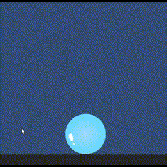

# SpriteCutterAsset
 A simple free 2D sprite cutter for Unity

 

## Current Features:
- Can perform sprite splitting on any SpriteRenderer
- Actual texture modification along the cut by clearing out the pixels in each slice
- Easy-to-use prefab, just drop into the scene and will cut any SpriteRenderer (with an attached collider)
- Input Manager should be able to handle both old and new Input Systems
- Can perform splitting on multiple sprites at once
- 2 simple demo scenes to demonstrate and test the asset

## Current Issues/Bugs:
While most features are implemented, there are still some persisting issues/bugs that still need to be ironed out before it is ready.
- Performing many successive sprite cutting causes the textures to not be cut/cleared in an expected manner
- Again, multiple successive cutting still has some issues with input detection and line intersecting

## Limitations:
- The most obvious limitation regarding 2D sprite splitting is convex shape splitting since these shapes don't always necessarily resolve to 2 sperate slices
- This asset always generate 2 slices no matter the shape
- This asset does not check for empty textures or sprites of very small area or dimensions (May add a feature to correct this in the future)
- Technically not a limitation but this asset depends on Unity's PolyCollider2D for the split sprites which can easily cause performance issues if too many split sprites are present in the scene

## Changelog:
v0.2.5
- Minor fix to coordinate conversion
- Added comments to SpriteCutterUtils
- Fixed positioning of generated GameObjects after splitting

v0.2
- Major revisions to the sprite cutting and texture generation
- Uses Graphics.CopyTexture() which should allow non-readable textures to still be split
- Various functions have been removed/replaced with better approach

v0.1
- Currently a WIP that still has a lot of room for improvement
- It works but sometimes does not properly detect or incorrectly cuts the sprites
- Will most likely shift the processing of textures to a native plugin